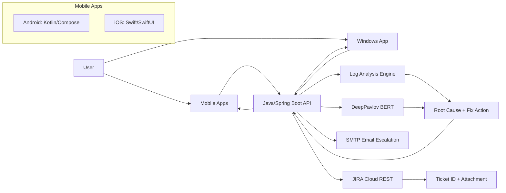
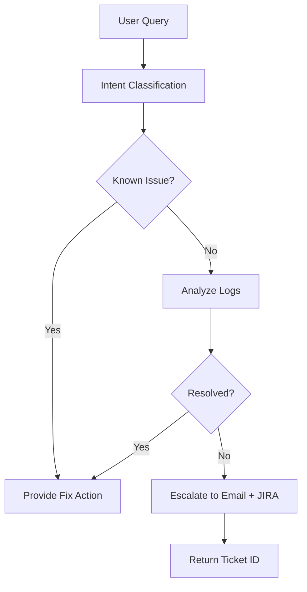
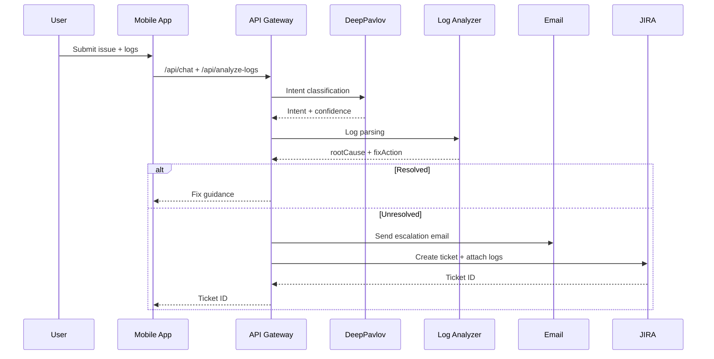

# Architecture: Aegis Agent

> Detailed system design, core flows, and technology decisions.

## 1) System Overview

Aegis Agent combines a cloud AI service, a Java/Spring Boot backend, and native mobile clients. It ingests user queries and logs, performs intent classification and log analysis, then resolves issues or escalates to email and JIRA with full context.

## 2) High-Level Delivery Path

| Step | Focus | Outcome |
| --- | --- | --- |
| 1 | Define purpose and scope | OTP/passkey education, log analysis, escalation |
| 2 | Select platform and tools | Java/Spring Boot, DeepPavlov, SMTP, JIRA |
| 3 | Set up NLP and intents | Labeled MFA intents and confidence thresholds |
| 4 | Integrate external services | Log storage, email escalation, ticketing |
| 5 | Design dialog flow | Playbooks for common MFA issues |
| 6 | Build client entry points | Android, iOS, Windows chat + log upload |
| 7 | Test and refine | Real logs, tuned intents and parsing |
| 8 | Deploy and iterate | Telemetry-driven improvements |

---

## 3) Architecture Diagram

---

## 4) Runtime Flow

---

## 5) Sequence Diagram

---

## 6) Tech Stack (IAM-Focused)

- Backend: Java 17, Spring Boot 3.x, REST APIs
- AI Engine (Cloud): DeepPavlov (BERT intent classifier)
- On-Device AI:
  - Android: TensorFlow Lite (quantized INT8, 28 MB)
  - iOS: Core ML (FP16, 55 MB)
  - Windows: Windows ML (ONNX Runtime, 110 MB)
- Log Analysis: JELK Stack (Elasticsearch + Logstash + Kibana)
- Client Apps: Android (Kotlin/Compose), iOS (Swift/SwiftUI), Windows (WinUI 3)
- Email: SMTP
- JIRA: Cloud REST API + Attachments API

---

## 7) Competitive Landscape (High-Level)

**What strong competitors do well**
- Provide multi-channel intake (in-app chat, email, web portal).
- Correlate IdP logs with device telemetry to reduce false escalation.
- Use confidence-based routing with human handoff thresholds.
- Standardize escalations with rich, structured context.

**Gaps to exploit**
- Few solutions deliver offline-first MFA support on-device.
- Most L1 systems do not attach raw logs with standardized root-cause summaries.
- IAM domain expertise is often generic rather than MFA-specific.

---

## 8) Recommendations

- Keep DeepPavlov for deterministic intent classification and data control.
- Add retrieval (Haystack) if knowledge base growth becomes a priority.
- Adopt ELK or Splunk for cross-correlation of IdP + device logs.
- Keep on-device inference for top intents to reduce server load and improve UX.

---

## 9) Security and Responsible AI

**Data protection**
- PII is redacted, identifiers are hashed, and logs are encrypted in transit and at rest.
- Short-lived signed URLs protect uploads and limit exposure windows.

**Access control**
- Role-based access is enforced for log viewing and ticket operations.
- Least-privilege API keys and scoped JIRA tokens are used.

**Auditability**
- Immutable audit logs track classifications, parsing, and ticket creation end-to-end.
- Escalation bundles use stable incident IDs for traceability.

**Safety and responsibility**
- Guidance avoids destructive steps that could lock users out.
- Confidence levels are surfaced and missing context is requested before escalation.
- Human override and clear R&D handoff are supported when confidence is low.

**Compliance**
- GDPR alignment is maintained via data minimization, retention limits, and deletion support.
- HIPAA (if PHI is present) is supported through encryption, restricted access, and access logging.

---

## 10) JIRA Escalation Payload (Required Fields)

- summary
- priority
- labels
- components
- reporter
- description (auto-built from chat + logs + device context)
- attachment (raw log file)

---

## 11) Phase 2 Hybrid Intelligence

Local-first intent classification is used for offline support and lower latency. If local confidence is below threshold, the request is forwarded to the cloud model.
