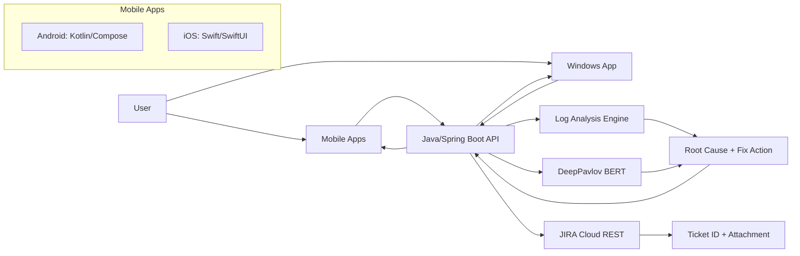
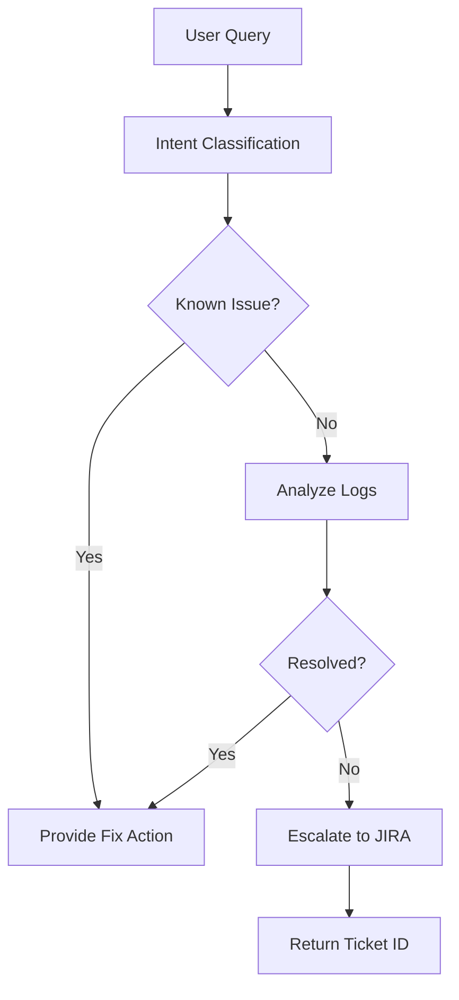
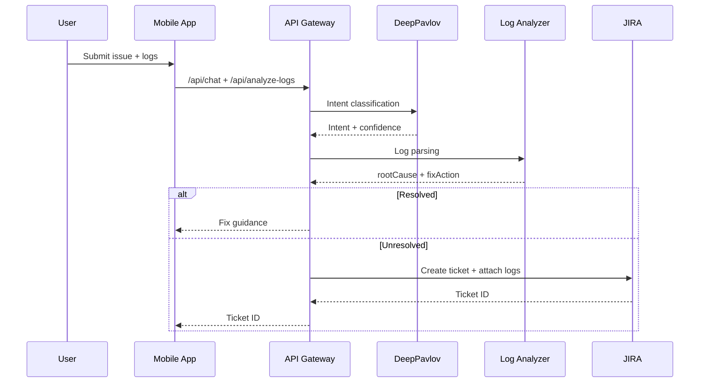

# Architecture

## System Overview
Aegis Agent combines a cloud AI service, a Java/Spring Boot backend, and native mobile clients. It ingests user queries and logs, performs intent classification and log analysis, then resolves issues or escalates to JIRA with full context.

## Architecture Diagram

## Flow Chart

## Sequence Diagram

## Tech Stack
- Backend: Java, Spring Boot, REST APIs
- AI Engine: DeepPavlov (BERT intent classifier)
- Log Analysis: Java regex-based parser
- Mobile Apps: Android (Kotlin/Compose), iOS (Swift/SwiftUI)
- JIRA: Cloud REST API + Attachments API
- Phase 2: Android TFLite/Gemini Nano, iOS Core ML

## JIRA Escalation Payload (Required Fields)
- summary
- priority
- labels
- components
- reporter
- description (auto-built from chat + logs + device context)
- attachment (raw log file)

## Phase 2 Hybrid Intelligence
Local-first intent classification is used for offline support and lower latency. If local confidence is below threshold, the request is forwarded to the cloud model.
