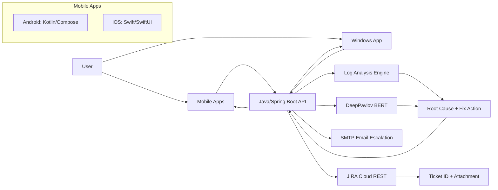
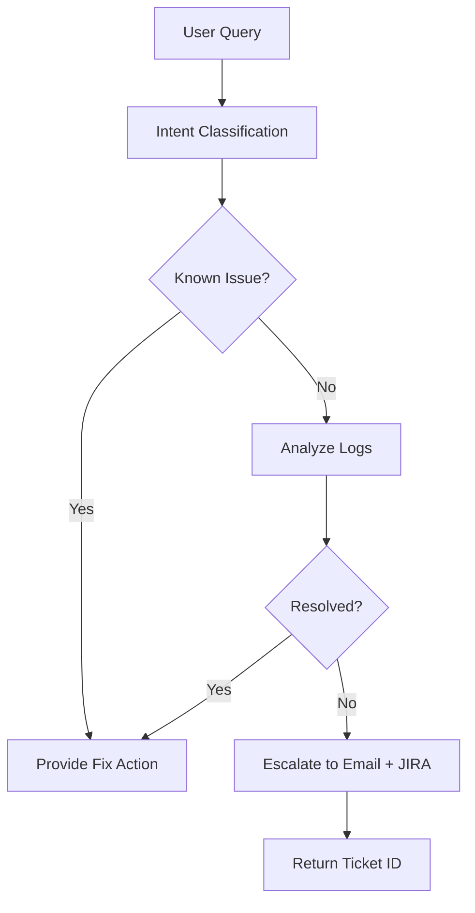
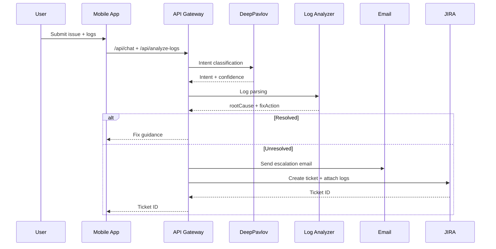

# Architecture

## System Overview
Aegis Agent combines a cloud AI service, a Java/Spring Boot backend, and native mobile clients. It ingests user queries and logs, performs intent classification and log analysis, then resolves issues or escalates to email and JIRA with full context.

## High-Level Delivery Path
1. Define purpose and scope for the assistant: OTP/passkey education, log analysis, and escalation.
2. Select platform and tools: Java/Spring Boot backend, DeepPavlov for intents, SMTP for email, JIRA for tickets.
3. Set up NLP and intent classification with labeled MFA intents and confidence thresholds.
4. Integrate external services: log storage, JIRA, and email for escalation workflows.
5. Design dialog flow and troubleshooting playbooks for common MFA issues.
6. Build client entry points: Android, iOS, and Windows surfaces for chat and log upload.
7. Test and refine with real logs and issue scenarios; tune intents and parsing.
8. Deploy and iterate with telemetry-driven improvements and updated response packs.

## Architecture Diagram

## Flow Chart

## Sequence Diagram

## Tech Stack
- Backend: Java, Spring Boot, REST APIs
- AI Engine: DeepPavlov (BERT intent classifier)
- Log Analysis: Java regex-based parser
- Mobile Apps: Android (Kotlin/Compose), iOS (Swift/SwiftUI)
- Email: SMTP
- JIRA: Cloud REST API + Attachments API
- Phase 2: Android TFLite/Gemini Nano, iOS Core ML

## Tech Stack Options (IAM-Focused)
**AI Engines (Cloud)**
- DeepPavlov: Open source, self-hosted, strong for intent classification and data control.
- Rasa NLU (DIET): Full control, flexible pipelines, strong enterprise deployments.
- Haystack + Transformers: Best for knowledge-base question answering and retrieval.
- Azure AI Language: Enterprise SLAs, strong Microsoft ecosystem fit.
- AWS Comprehend + Bedrock: Scalable intent + policy-driven deployment on AWS.

**On-Device AI**
- Android: TFLite (quantized) for portability; Gemini Nano via AICore where available.
- iOS: Core ML + Natural Language for low-latency inference.

**Log Analysis (Mobile + Windows)**
- ELK (Elasticsearch/Logstash/Kibana): Search, correlation, and dashboards at scale.
- Splunk: Security-grade analytics and compliance-driven audit trails.
- Datadog Logs: Fast setup and strong observability UX.
- Azure Monitor + Log Analytics: Native Windows/AD integration and IAM alignment.

## Competitive Landscape (High-Level)
**What strong competitors do well**
- Provide multi-channel intake (in-app chat, email, web portal).
- Correlate IdP logs with device telemetry to reduce false escalation.
- Use confidence-based routing with human handoff thresholds.
- Standardize escalations with rich, structured context.

**Gaps to exploit**
- Few solutions deliver offline-first MFA support on-device.
- Most L1 systems do not attach raw logs with standardized root-cause summaries.
- IAM domain expertise is often generic rather than MFA-specific.

## Recommendations
- Keep DeepPavlov for deterministic intent classification and data control.
- Add retrieval (Haystack) if knowledge base growth becomes a priority.
- Adopt ELK or Splunk for cross-correlation of IdP + device logs.
- Keep on-device inference for top intents to reduce server load and improve UX.

## JIRA Escalation Payload (Required Fields)
- summary
- priority
- labels
- components
- reporter
- description (auto-built from chat + logs + device context)
- attachment (raw log file)

## Phase 2 Hybrid Intelligence
Local-first intent classification is used for offline support and lower latency. If local confidence is below threshold, the request is forwarded to the cloud model.
