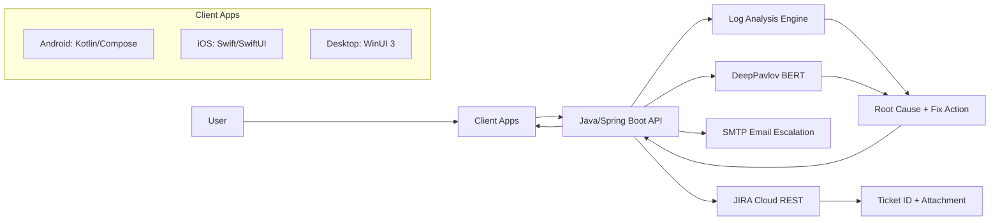
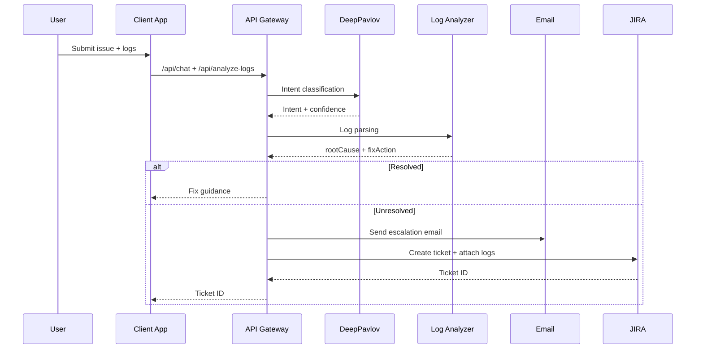

# Architecture: Aegis Agent

> Detailed system design, core flows, and technology decisions.

## 1) System Overview

Aegis Agent combines a cloud AI service, a Java/Spring Boot backend, and Client Apps (Android, iOS and Desktop). It ingests user queries and logs, performs intent classification and log analysis, then resolves issues or escalates to email and JIRA with full context.

## 2) High-Level Delivery Path

| Step | Focus | Outcome |
| --- | --- | --- |
| 1 | Define purpose and scope | OTP/passkey education, log analysis, escalation |
| 2 | Select platform and tools | Java/Spring Boot, DeepPavlov, SMTP, JIRA |
| 3 | Set up NLP and intents | Labeled MFA intents and confidence thresholds |
| 4 | Integrate external services | Log storage, email escalation, ticketing |
| 5 | Design dialog flow | Playbooks for common MFA issues |
| 6 | Build client entry points | Android, iOS, Windows chat + log upload |
| 7 | Test and refine | Real logs, tuned intents and parsing |
| 8 | Deploy and iterate | Telemetry-driven improvements |

---

## 3) Architecture Diagram

---

## 4) Runtime Flow

---

## 5) Sequence Diagram

---

## 6) Tech Stack (IAM-Focused)

- Backend: Java 17, Spring Boot 3.x, REST APIs
- AI Engine (Cloud): DeepPavlov (BERT intent classifier)
- On-Device AI:
  - Android: TensorFlow Lite (quantized INT8, 28 MB)
  - iOS: Core ML (FP16, 55 MB)
  - Windows: Windows ML (ONNX Runtime, 110 MB)
- Log Analysis: OpenSearch Stack (OpenSearch + OpenSearch Dashboards + Data Prepper)
- Client Apps: Android (Kotlin/Compose), iOS (Swift/SwiftUI), Windows (WinUI 3)
- Email: SMTP
- JIRA: Cloud REST API + Attachments API

---

## 7) IAM Domain Model

**Protocol coverage**
- OTP: TOTP/HOTP flows and seed lifecycle issues.
- Passkeys: FIDO2/WebAuthn registration and assertion failures.
- Biometrics and push: local factor lockout, push timeout, approval mismatch.

**Intent taxonomy (minimum)**
- EnrollmentFailure
- GenerateOTP
- TokenSyncError
- ConfigIssue
- ServerUnreachable
- PushApprovalTimeout
- PasskeyRegistrationFailure
- BiometricLockout
- TimeDriftFailure
- DeviceBindingFailure

**Event taxonomy for root cause**
- Auth failures (invalid/expired challenge, policy deny, risk block)
- Device failures (clock skew, cert trust, key storage, app state)
- Transport failures (network timeout, 5xx, proxy/TLS)

---

## 8) Data and Connector Strategy

**Open-source first ingestion path**
- Data Prepper/collectors ingest client logs and backend events into OpenSearch.
- Dashboards provide forensic views for support and engineering.

**IAM provider adapters (optional but recommended)**
- Okta: System Log API for event correlation and incident context.
- Microsoft Entra: sign-in log adapter (Graph/API export path).
- Extensible adapter interface for Ping and Google identity sources.

**Correlation keys**
- `request_id`, `session_id`, `challenge_id`, `user_id_hash`, `device_id_hash`, `idp_event_id`

---

## 9) Escalation Quality Gate

- Escalate only if one of these is true:
  - model confidence below threshold
  - no deterministic fix from playbook/rules
  - user confirms issue still unresolved
- Escalation bundle must include:
  - sanitized raw log file
  - inferred root cause + confidence
  - attempted fix steps
  - device/app metadata
  - correlation identifiers

---

## 10) Evaluation Metrics

- Intent quality: precision/recall/F1 per IAM intent.
- Triage quality: root-cause precision@1 and precision@3.
- Support outcomes: first-contact resolution, mean time to resolution, false escalation rate.
- Safety outcomes: unsafe-action suggestion rate and human-override frequency.

---

## 11) Security and Responsible AI

**Data protection**
- PII is redacted, identifiers are hashed, and logs are encrypted in transit and at rest.
- Short-lived signed URLs protect uploads and limit exposure windows.

**Access control**
- Role-based access is enforced for log viewing and ticket operations.
- Least-privilege API keys and scoped JIRA tokens are used.

**Auditability**
- Immutable audit logs track classifications, parsing, and ticket creation end-to-end.
- Escalation bundles use stable incident IDs for traceability.

**Safety and responsibility**
- Guidance avoids destructive steps that could lock users out.
- Confidence levels are surfaced and missing context is requested before escalation.
- Human override and clear R&D handoff are supported when confidence is low.

**Compliance**
- GDPR alignment is maintained via data minimization, retention limits, and deletion support.
- HIPAA (if PHI is present) is supported through encryption, restricted access, and access logging.

---

## 12) Phase 2 Hybrid Intelligence

Local-first intent classification is used for offline support and lower latency. If local confidence is below threshold, the request is forwarded to the cloud model.
