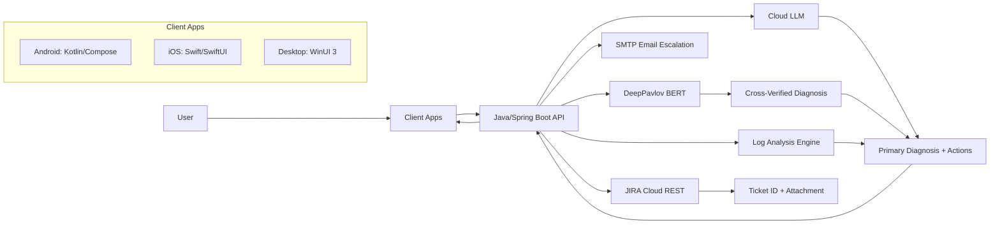
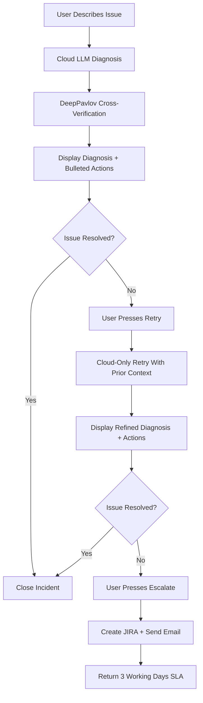
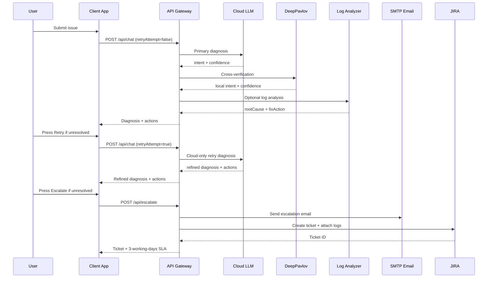

# Diagrams

## System Architecture

```mermaid
flowchart LR
  User[User] --> Clients[Client Apps]

  subgraph Client Apps
    Android[Android: Kotlin/Compose]
    iOS[iOS: Swift/SwiftUI]
    Desktop[Desktop: WinUI 3]
  end

  Clients --> API[Java/Spring Boot API]

  API --> Cloud[Cloud LLM]
  API --> AI[DeepPavlov BERT]
  API --> Logs[Log Analysis Engine]
  API --> Email[SMTP Email Escalation]
  API --> JIRA[JIRA Cloud REST]

  Cloud --> ResultA[Primary Diagnosis + Actions]
  AI --> ResultB[Cross-Verified Diagnosis]
  ResultB --> ResultA
  Logs --> ResultA
  ResultA --> API
  JIRA --> Ticket[Ticket ID + Attachment]
  API --> Clients
```

## Troubleshooting Flow

```mermaid
flowchart TD
  Start[User Describes Issue] --> Cloud[Cloud LLM Diagnosis]
  Cloud --> Local[DeepPavlov Cross-Verification]
  Local --> Guided[Display Diagnosis + Bulleted Actions]
  Guided --> Fixed{Issue Resolved?}
  Fixed -->|Yes| End[Close Incident]
  Fixed -->|No| Retry[User Presses Retry]
  Retry --> CloudRetry[Cloud-Only Retry With Prior Context]
  CloudRetry --> Guided2[Display Refined Diagnosis + Actions]
  Guided2 --> Fixed2{Issue Resolved?}
  Fixed2 -->|Yes| End
  Fixed2 -->|No| Escalate[User Presses Escalate]
  Escalate --> Ticket[Create JIRA + Send Email]
  Ticket --> SLA[Return 3 Working Days SLA]
```

## Escalation Sequence

```mermaid
sequenceDiagram
  participant U as User
  participant M as Client App
  participant A as API Gateway
  participant C as Cloud LLM
  participant D as DeepPavlov
  participant L as Log Analyzer
  participant E as SMTP Email
  participant J as JIRA

  U->>M: Submit issue
  M->>A: POST /api/chat (retryAttempt=false)
  A->>C: Primary diagnosis
  C-->>A: intent + confidence
  A->>D: Cross-verification
  D-->>A: local intent + confidence
  A->>L: Optional log analysis
  L-->>A: rootCause + fixAction
  A-->>M: Diagnosis + actions
  U->>M: Press Retry if unresolved
  M->>A: POST /api/chat (retryAttempt=true)
  A->>C: Cloud-only retry diagnosis
  C-->>A: refined diagnosis + actions
  A-->>M: Refined diagnosis + actions
  U->>M: Press Escalate if unresolved
  M->>A: POST /api/escalate
  A->>E: Send escalation email
  A->>J: Create ticket + attach logs
  J-->>A: Ticket ID
  A-->>M: Ticket + 3-working-days SLA
```
