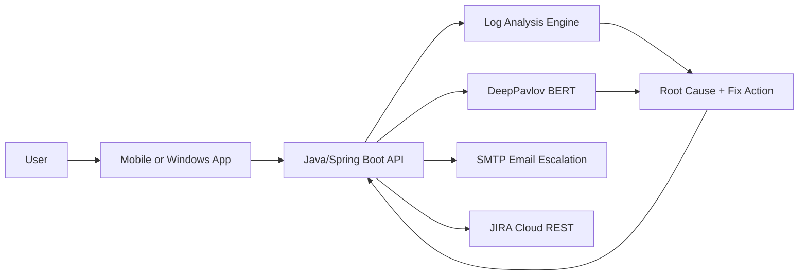

# Aegis Agent - Authenticator App Support Bot

An intelligent L1 support agent for Authenticator Mobile and Windows applications. It guides users through OTP, passkey, and approval flows, troubleshoots issues, analyzes logs for root causes, and escalates unresolved cases to email and JIRA with full context.

---

## Objectives
- Provide fast, accurate L1 support for OTP and passkey-based authentication.
- Educate users on app workflows and approval flows.
- Automate troubleshooting with log-based root-cause analysis.
- Escalate unresolved cases to email and JIRA with complete context and attachments.

## What / Why / How
**What**: Aegis Agent is a support layer for Authenticator applications that handles first-line support and log-driven diagnostics.

**Why**: MFA login issues drive user friction and ticket volume. Aegis Agent standardizes troubleshooting and shortens time-to-resolution.

**How**: Phase 1 uses a cloud-centric model (Java + DeepPavlov) and native clients. Phase 2 adds on-device AI for offline support and latency reduction.

---

## User Journey (High Level)
1. User asks a question or reports a login issue.
2. Agent classifies intent and collects device context.
3. Logs are analyzed for known failure patterns.
4. Agent returns guidance or escalates to email and JIRA with full context.

---

## Architecture Snapshot

---

## Phase Roadmap
| Phase | Focus | Outcome |
| --- | --- | --- |
| Phase 1: Core | Java + DeepPavlov + Native Apps + JIRA | Cloud-first, reliable troubleshooting and escalation |
| Phase 2: Hybrid AI | On-device AI + response packs | Offline capability and lower latency |

---

## Key Capabilities
- Intent classification for common MFA issues.
- Log analysis with root-cause suggestions.
- Structured escalation to email and JIRA with log attachment.
- Mobile-first chat UI and log upload.

---

## Quick Links
- Architecture: `docs/ARCHITECTURE.md`
- Implementation Guide: `docs/IMPLEMENTATION_GUIDE.md`
- Implementation Prompt: `docs/IMPLEMENTATION_PROMPT.md`
- Diagrams: `docs/DIAGRAMS.md`
