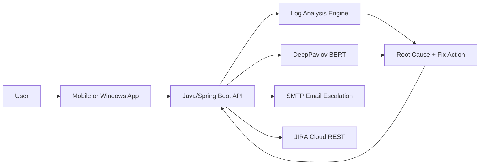

# Aegis Agent - Authenticator App Support Bot

Intelligent L1 support for Authenticator Mobile and Windows apps. Guides users through OTP, passkey, and approval flows, troubleshoots issues, analyzes logs for root causes, and escalates unresolved cases to email and JIRA with full context.

---

## What It Delivers
| Capability | Outcome |
| --- | --- |
| User education | Clear guidance on OTP, passkeys, and approvals |
| Troubleshooting | Fast resolution with log-driven diagnostics |
| Escalation | Email + JIRA tickets with full context and attachments |

## How It Works
1. User reports an issue.
2. Intent is classified with device context.
3. Logs are analyzed for known patterns.
4. Guidance is returned or escalated to email + JIRA.

## Build Path (Short)
| Step | Focus | Outcome |
| --- | --- | --- |
| 1 | Define scope | OTP/passkey education, log analysis, escalation |
| 2 | Build core | Java API + DeepPavlov intents + log parser |
| 3 | Integrate | SMTP email, JIRA tickets, log storage |
| 4 | Ship clients | Android, iOS, Windows surfaces |
| 5 | Test and iterate | Improvements from real logs and feedback |

## Architecture Snapshot

## Phase Roadmap
| Phase | Focus | Outcome |
| --- | --- | --- |
| Phase 1: Core | Java + DeepPavlov + Native Apps + JIRA | Cloud-first troubleshooting and escalation |
| Phase 2: Hybrid AI | On-device AI + response packs | Offline capability and lower latency |

## Security and Responsible AI
| Area | Recommendation |
| --- | --- |
| Data protection | Redact PII (email, phone, tokens), hash identifiers, encrypt logs at rest and in transit. |
| Access control | Role-based access to logs and tickets, least-privilege API keys, scoped JIRA tokens. |
| Auditability | Keep immutable audit logs for actions, ticket creation, and escalations. |
| Safety | Provide safe, non-destructive guidance; avoid steps that could lock users out. |
| Transparency | Show confidence level and ask for missing context before escalation. |
| Compliance | Align with GDPR and HIPAA where applicable (minimize data, retention limits, access logging). |

## Quick Links
- Architecture: `docs/ARCHITECTURE.md`
- Implementation Guide: `docs/IMPLEMENTATION_GUIDE.md`
- Implementation Prompt: `docs/IMPLEMENTATION_PROMPT.md`
- Diagrams: `docs/DIAGRAMS.md`
